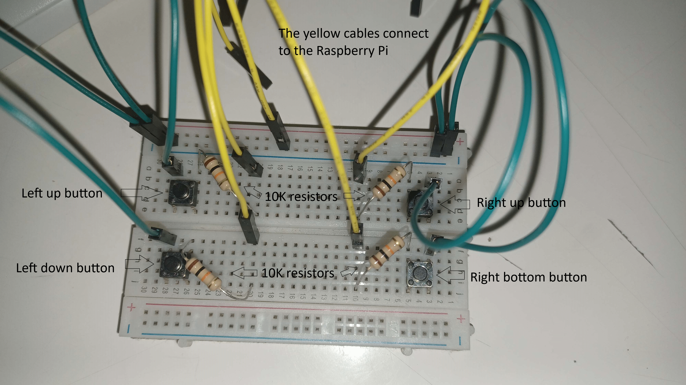

# Python Pygame Pong

## What is it?

It is a Pong game with Raspbbery Pi support originally made within just 2 days using Pygame. For those who don't know what [Pong](https://en.wikipedia.org/wiki/Pong) is, it is basically this 1970's arcade game where you have to score the ball on the opponent player.

## Installation

1) Install Python 3 from <https://www.python.org/downloads/>
2) Clone the repository either by using Git or by clicking the green button saying "Code" (after downloading, don't forget to unzip the file)
3) `cd` to the repo directory
4) Type `pip3 install -r requirements.txt` for Windows or `python3 -m pip install -r requirements.txt` for Linux. If you are installing this on a Raspberry Pi and wanna use the GPIO to play the game, type ``python3 -m pip install -r requirements.txt -r rpi-requirements.txt`
5) Create a new empty directory named "logs"
6) To run the game, run `main.py` for Windows or `python3 main.py` for Linux. If you wanna use the GPIO, type `python3 main.py --rpi-gpio`. Remote GPIO is also supported.
7) On Linux, if `pygame` raises an exception when running `pygame.font.init()`, open the terminal, type `sudo apt update`, then `sudo apt install libsdl2-ttf-2.0-0` and re-run `main.py`

## Setup for Raspberry Pi
Just connect four pull-up buttons to BCM GPIO's 22, 23, 24 and 27. When pushing the button at Pin 27, the right paddle will go up, on Pin 23 down, on Pin 22 the left paddle will go up and on Pin 24 down.

The schematic is shown below:


This circuit, when constructed on a breadboard, looks somewhat like this:



### Custom pin numbering
Simply, create a file named `.env`. The values of variables `LEFT_UP`, `LEFT_DOWN`, `RIGHT_UP` and `RIGHT_DOWN` will be the pin numbers of each button that triggers the corresponding action (for example, a `.env` file with the contents
```
LEFT_UP: "4"
RIGHT_DOWN: "BOARD5" 
```
would change the pin for moving the left paddle up to GPIO 4 and for movng the right paddle down to Board pin 5 (the GPIO 3 pin))

## TODO

* [x] Make ball disappear when touched left or right border
* [x] Add score counter
* [x] Embed `logging` module
* [x] Make window resizable
* [x] Make the GPIO numbers easily configurable
